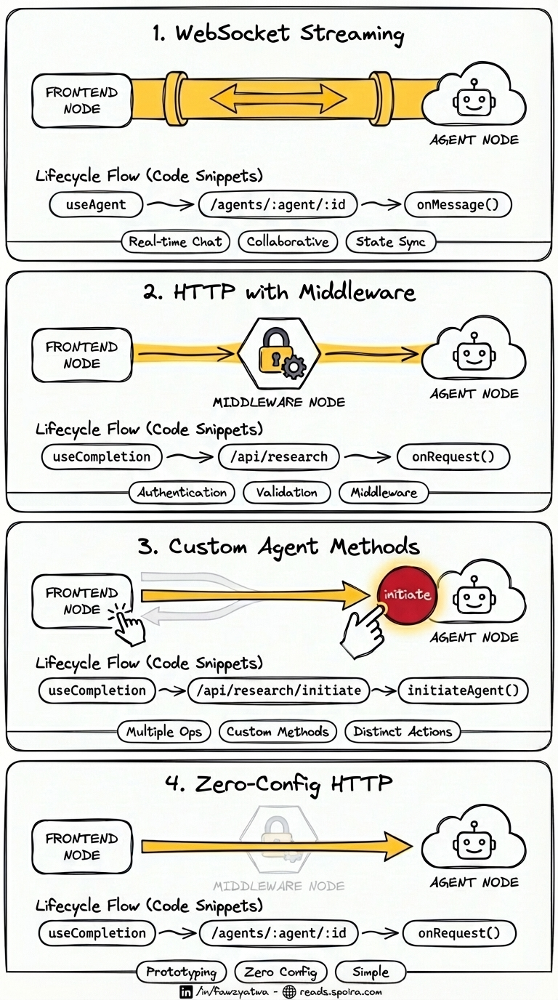

# Building AI Agents on Cloudflare: A Practical Guide



The first time I got a Vercel AI Agent to stream a response through a Cloudflare Durable Object, I sat there watching the text flow in, chunk by chunk, and thought: _this is exactly how AI agents should be built_.

I'd been experimenting with various agent frameworks for months. Most of them felt like you were fighting the infrastructure as much as building the actual agent. But when I discovered that Cloudflare's Agent SDK could serve as the stateful container while Vercel's AI SDK handled the cognitive layer—that clicked. Two tools, each excellent at their job, working together without getting in each other's way.

This project is the result of that exploration: a working reference implementation that demonstrates multiple patterns for building AI agents using this stack.

---

## What This Project Demonstrates

This isn't just a starter template. It's a collection of working examples that show you different ways to connect your frontend to AI agents, each with its own trade-offs. By the time you finish reading this, you'll understand:

- How to build stateful AI agents using Cloudflare Durable Objects
- How to integrate Vercel's AI SDK for LLM orchestration and tool use
- Four distinct patterns for frontend-to-agent communication
- When to use WebSockets vs HTTP streaming
- Common pitfalls and how to avoid them (so you don't have to debug the same issues I did)

---

## The Stack

| Layer                  | Technology               | Purpose                                              |
| ---------------------- | ------------------------ | ---------------------------------------------------- |
| **Runtime**            | Cloudflare Workers       | Edge compute, global distribution                    |
| **State**              | Durable Objects          | Per-user agent instances, persistence, SQLite        |
| **Agent Container**    | Cloudflare Agents SDK    | Lifecycle management, WebSocket handling, state sync |
| **AI Orchestration**   | Vercel AI SDK            | LLM calls, tool execution, streaming responses       |
| **Backend Framework**  | Hono                     | Lightweight routing, middleware, API endpoints       |
| **Frontend Framework** | React Router v7          | Client routing, SSR-ready, file-based routes         |
| **UI Components**      | shadcn/ui + Tailwind CSS | Clean, accessible component library                  |
| **Language**           | TypeScript               | End-to-end type safety                               |

### Key Dependencies

[`agents`](https://npmjs.com/package/agents) | [`ai`](https://npmjs.com/package/ai) | [`@ai-sdk/openai`](https://npmjs.com/package/@ai-sdk/openai) | [`@ai-sdk/react`](https://npmjs.com/package/@ai-sdk/react) | [`hono`](https://npmjs.com/package/hono) | [`react-router`](https://npmjs.com/package/react-router) | [`zod`](https://npmjs.com/package/zod) | [`wrangler`](https://npmjs.com/package/wrangler)

> See [`package.json`](./package.json) for exact versions.

---

## Why This Stack?

### The Discovery

I stumbled onto this combination while trying to solve a specific problem: I wanted agents that could maintain conversation state, persist data, schedule tasks, and stream responses—all without managing infrastructure.

Cloudflare's Agent SDK, built on Durable Objects, gives you:

- **Per-user isolation**: Each user gets their own agent instance
- **Built-in SQLite**: Persistent storage without external databases
- **WebSocket support**: Real-time bidirectional communication
- **Automatic scaling**: From zero to millions without configuration

Vercel's AI SDK gives you:

- **Unified LLM interface**: Swap models without changing code
- **First-class streaming**: Built for incremental token delivery
- **Tool abstraction**: Define capabilities with schemas, let the AI decide when to use them
- **Agent primitives**: The `Experimental_Agent` class handles multi-step reasoning

Together, they form what I think is the most practical stack for building AI agents today. Cloudflare handles the "where does this agent live and how do I talk to it" problem. Vercel handles the "how does the agent think and act" problem.

### The Compatibility Challenge

Here's the thing nobody tells you: getting these two SDKs to work together smoothly requires understanding some subtle details about streaming protocols, serialization boundaries, and routing conventions.

When I first tried to return a `StreamTextResult` from a Durable Object RPC call, I got a cryptic `DataCloneError`. It turns out Durable Objects can only pass serializable data across their boundary—and stream objects aren't serializable. The fix is to call `.toTextStreamResponse()` inside the Durable Object and return the `Response` object instead.

When I used Vercel's `useCompletion` hook with an agent that returned plain text streams, I got parsing errors. Turns out `useCompletion` expects a specific data stream protocol by default. The fix is setting `streamProtocol: "text"` in the hook options.

I built this project so you don't have to debug these issues yourself. Every pattern here is tested and working.

---

## Architecture Overview

```
┌─────────────────────────────────────────────────────────────────────┐
│                           Frontend (React)                          │
├─────────────────────────────────────────────────────────────────────┤
│  useAgent (WebSocket)  │  useCompletion (HTTP)  │  useChat (HTTP)   │
└────────────┬───────────┴───────────┬────────────┴─────────┬─────────┘
             │                       │                      │
             ▼                       ▼                      ▼
┌─────────────────────────────────────────────────────────────────────┐
│                        Hono API Layer                               │
├─────────────────────────────────────────────────────────────────────┤
│  /agents/* (routeAgentRequest)  │  /api/research  │  /api/custom    │
└────────────┬────────────────────┴────────┬────────┴────────┬────────┘
             │                             │                 │
             ▼                             ▼                 ▼
┌─────────────────────────────────────────────────────────────────────┐
│                    Cloudflare Agent (Durable Object)                │
├─────────────────────────────────────────────────────────────────────┤
│  onMessage() ← WebSocket    │    onRequest() ← HTTP fetch           │
│  initiateAgent() ← RPC      │    Custom methods                     │
└────────────┬────────────────┴────────┬──────────────────────────────┘
             │                         │
             ▼                         ▼
┌─────────────────────────────────────────────────────────────────────┐
│                        Vercel AI Agent                              │
├─────────────────────────────────────────────────────────────────────┤
│  Model (GPT-4o)  │  System Prompt  │  Tools (weather, flights, etc) │
└─────────────────────────────────────────────────────────────────────┘
```

### How the Pieces Fit Together

1. **Frontend Layer**: React components use either Cloudflare's `useAgent` hook (WebSocket) or Vercel's `useCompletion`/`useChat` hooks (HTTP streaming) to communicate with agents.

2. **API Layer**: Hono routes handle incoming requests. The `routeAgentRequest()` function automatically routes WebSocket connections to the right agent. Custom API routes give you middleware control for authentication, validation, etc.

3. **Agent Layer**: Cloudflare Agent classes extend `Agent<Env>` and implement handlers like `onMessage()` (WebSocket), `onRequest()` (HTTP), or custom RPC methods. Each agent instance is a Durable Object—isolated, persistent, globally unique.

4. **AI Layer**: Inside the agent, a Vercel AI Agent handles the actual reasoning. You define tools, set a system prompt, choose a model, and stream responses back.

---

## The Four Integration Patterns

This project demonstrates four distinct ways to connect your frontend to AI agents, organized by transport type and complexity. Each pattern has legitimate use cases—there's no single "right" answer.

---

### 🔌 WebSocket Patterns

Persistent bidirectional connections for real-time communication.

---

### Pattern 1: WebSocket Streaming

**Frontend**: [`app/routes/direct-agent.tsx`](./app/routes/direct-agent.tsx)  
**Backend**: [`workers/agents/ResearchAgent.ts`](./workers/agents/ResearchAgent.ts) → `onMessage()`  
**Hook**: `useAgent()` from `agents/react`  
**Endpoint**: `/agents/:agent/:id`

The frontend establishes a WebSocket connection and sends messages:

```typescript
connection.send(JSON.stringify({ prompt: "Plan a trip to Tokyo" }));
```

The agent streams chunks back through the same connection:

```typescript
for await (const chunk of result.textStream) {
  connection.send(JSON.stringify({ type: "chunk", content: chunk }));
}
```

**When to use**: Chat interfaces, collaborative features, real-time state sync  
**Trade-offs**: More complex connection management, requires lifecycle handling

---

### 🌐 HTTP Patterns

Request-response streaming, ordered from simplest to most flexible.

---

### Pattern 2: Zero-Config HTTP

**Frontend**: [`app/routes/http-direct.tsx`](./app/routes/http-direct.tsx)  
**Backend**: Auto-handled by `routeAgentRequest()` in [`workers/app.ts`](./workers/app.ts)  
**Agent Handler**: [`workers/agents/ResearchAgent.ts`](./workers/agents/ResearchAgent.ts) → `onRequest()`  
**Hook**: `useCompletion()` from `@ai-sdk/react`

Frontend points directly to the agent URL pattern:

```typescript
const { completion, complete } = useCompletion({
  api: `/agents/${agentName}/${sessionId}`,
  streamProtocol: "text",
});
```

No custom Hono route needed—`routeAgentRequest()` handles everything.

**When to use**: Simplest setup, prototyping, MVPs  
**Trade-offs**: Less middleware control, direct endpoint exposure

---

### Pattern 3: HTTP with Middleware

**Frontend**: [`app/routes/http-streaming.tsx`](./app/routes/http-streaming.tsx)  
**Backend**: [`workers/app.ts`](./workers/app.ts) → `/api/research` route  
**Agent Handler**: [`workers/agents/ResearchAgent.ts`](./workers/agents/ResearchAgent.ts) → `onRequest()`  
**Hook**: `useCompletion()` from `@ai-sdk/react`

Frontend setup (critical: `streamProtocol: "text"`):

```typescript
const { completion, complete } = useCompletion({
  api: "/api/research",
  streamProtocol: "text", // ← Required for Vercel Agent plain text output
});
```

The Hono route retrieves the agent and forwards the request:

```typescript
const agent = await getAgentByName<Env, ResearchAgent>(
  c.env.ResearchAgent,
  userId
);
return agent.fetch(agentRequest);
```

**When to use**: REST architectures, when you need middleware (auth, rate limiting)  
**Trade-offs**: Unidirectional, no built-in state sync

---

### Pattern 4: Custom Agent Methods

**Frontend**: [`app/routes/http-streaming-initiate.tsx`](./app/routes/http-streaming-initiate.tsx)  
**Backend**: [`workers/app.ts`](./workers/app.ts) → `/api/research/initiate` route  
**Agent Handler**: [`workers/agents/ResearchAgent.ts`](./workers/agents/ResearchAgent.ts) → `initiateAgent()`  
**Hook**: `useCompletion()` from `@ai-sdk/react`

Instead of `agent.fetch()`, call a custom method directly:

```typescript
return (agent as any).initiateAgent(prompt);
```

The custom method must return a `Response` (serializable across DO boundary):

```typescript
initiateAgent(prompt: string): Response {
  const result = vercelAgent.stream({ prompt });
  return result.toTextStreamResponse(); // ← Must return Response, not StreamTextResult
}
```

**When to use**: Multiple entry points per agent, cleaner method signatures  
**Trade-offs**: Must return serializable types, TypeScript requires casting

---

## Project Structure

```
cf-hono-rr7-agents/
├── workers/
│   ├── app.ts                    # Hono entry point, API routes
│   ├── agents/
│   │   ├── ResearchAgent.ts      # Travel planning agent
│   │   └── SupportAgent.ts       # (Placeholder for future)
│   └── tools/
│       └── index.ts              # Tool definitions (weather, flights, hotels)
├── app/
│   ├── routes/
│   │   ├── home.tsx              # Landing page with pattern overview
│   │   ├── direct-agent.tsx      # Pattern 1: WebSocket Streaming
│   │   ├── http-direct.tsx       # Pattern 2: Zero-Config HTTP
│   │   ├── http-streaming.tsx    # Pattern 3: HTTP with Middleware
│   │   └── http-streaming-initiate.tsx  # Pattern 4: Custom Agent Methods
│   ├── routes.ts                 # Route definitions
│   └── components/ui/            # shadcn/ui components
├── docs/                         # Additional documentation
├── wrangler.jsonc                # Cloudflare configuration
└── package.json
```

---

## Getting Started

### Prerequisites

- Node.js 18+
- A Cloudflare account
- An OpenAI API key (or modify to use another provider)

### Installation

```bash
git clone <repository-url>
cd cf-hono-rr7-agents
pnpm install
pnpm run cf-typegen
```

### Configuration

1. Create a `.dev.vars` file in the root:

```bash
OPENAI_API_KEY=sk-your-api-key-here
```

2. Durable Object bindings are already configured in [`wrangler.jsonc`](./wrangler.jsonc).

### Development

```bash
pnpm run dev
```

Visit `http://localhost:5173` to see the pattern overview and try each integration.

### Deployment

```bash
pnpm run deploy
wrangler secret put OPENAI_API_KEY
```

---

## Creating Your Own Agent

### 1. Create the Agent Class

See [`workers/agents/ResearchAgent.ts`](./workers/agents/ResearchAgent.ts) for a complete example.

Key parts:

- Extend `Agent<Env>` from `agents`
- Create a Vercel Agent with `new VercelAgent({ model, system, tools, stopWhen })`
- Implement `onRequest()` for HTTP, `onMessage()` for WebSocket
- Define tools using `tool()` from `ai` with Zod schemas (see [`workers/tools/index.ts`](./workers/tools/index.ts))

### 2. Export and Configure

In [`workers/app.ts`](./workers/app.ts):

```typescript
export { MyAgent } from "./agents/MyAgent";
```

In [`wrangler.jsonc`](./wrangler.jsonc), add bindings and migrations for your new agent class.

### 3. Add API Routes (Optional)

See the existing routes in [`workers/app.ts`](./workers/app.ts) for patterns on retrieving agents with `getAgentByName()` and forwarding requests.

---

## Common Pitfalls & Solutions

### "Failed to parse stream string" Error

**Problem**: `useCompletion` expects AI SDK's data stream protocol by default.

**Solution**: Set `streamProtocol: "text"` in your hook options.

### DataCloneError: Could not serialize object

**Problem**: Returning `StreamTextResult` from a Durable Object RPC method.

**Solution**: Call `.toTextStreamResponse()` inside the DO method and return the `Response` object.

### WebSocket Connection Fails with 404

**Problem**: `useAgent` connects to `/agents/:agent/:name` but your routes don't match.

**Solution**: Ensure `app.all("/agents/*", ...)` with `routeAgentRequest()` comes BEFORE React Router's catch-all route.

### Agent Name Mismatch

**Problem**: `useAgent({ agent: "ResearchAgent" })` doesn't connect.

**Solution**: Agent names are kebab-cased. Use `"research-agent"` not `"ResearchAgent"`.

---

## When to Use What

| Scenario                              | Recommended Pattern              |
| ------------------------------------- | -------------------------------- |
| Real-time chat with typing indicators | Pattern 1 (WebSocket Streaming)  |
| Rapid prototyping / MVPs              | Pattern 2 (Zero-Config HTTP)     |
| Simple completion forms               | Pattern 2 (Zero-Config HTTP)     |
| API with authentication middleware    | Pattern 3 (HTTP with Middleware) |
| REST-only architecture                | Pattern 2 or 3 (HTTP patterns)   |
| Multiple operations per agent         | Pattern 4 (Custom Agent Methods) |
| Collaborative features                | Pattern 1 (WebSocket + setState) |

---

## Additional Resources

- [Cloudflare Agents SDK Documentation](https://developers.cloudflare.com/agents)
- [Vercel AI SDK Agents Guide](https://ai-sdk.dev/docs/agents/building-agents)
- [Hono Framework Documentation](https://hono.dev/)
- [React Router v7 Documentation](https://reactrouter.com/)

---

## Contributing

Found a bug? Have a pattern that should be included? Open an issue or PR.

---

## License

MIT

---

_Built by someone who got tired of debugging the same integration issues over and over, and decided to write them down instead._
